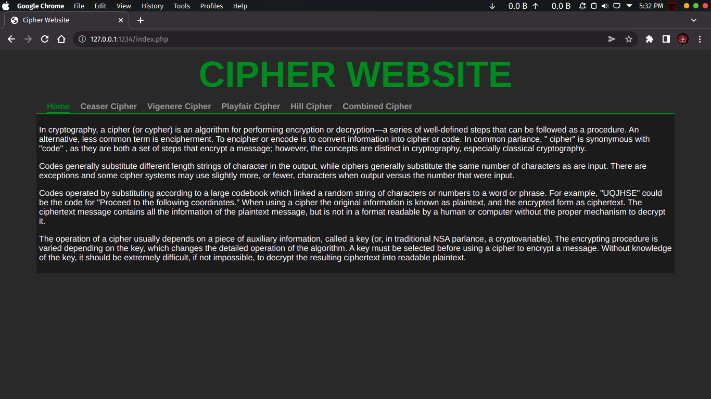
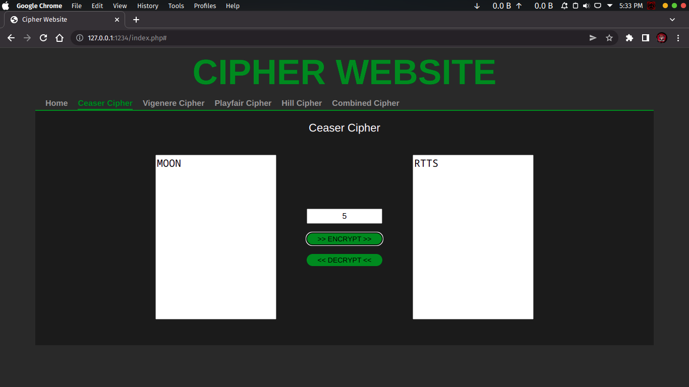
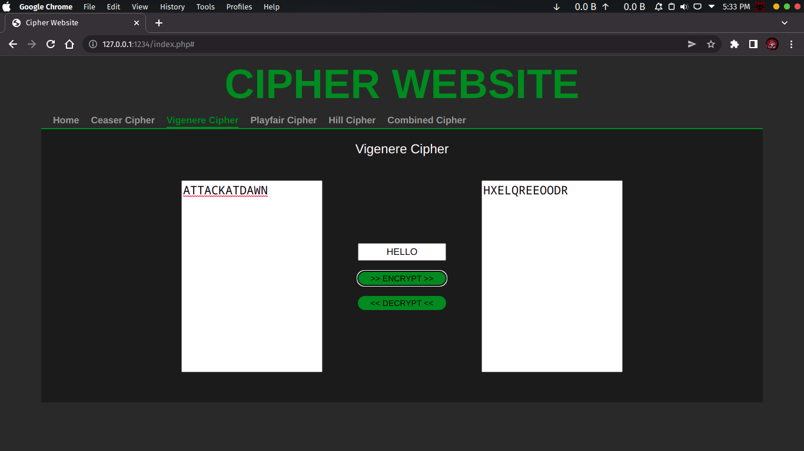
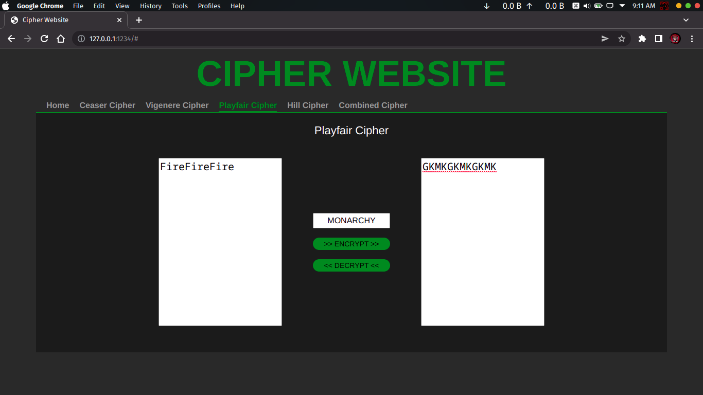
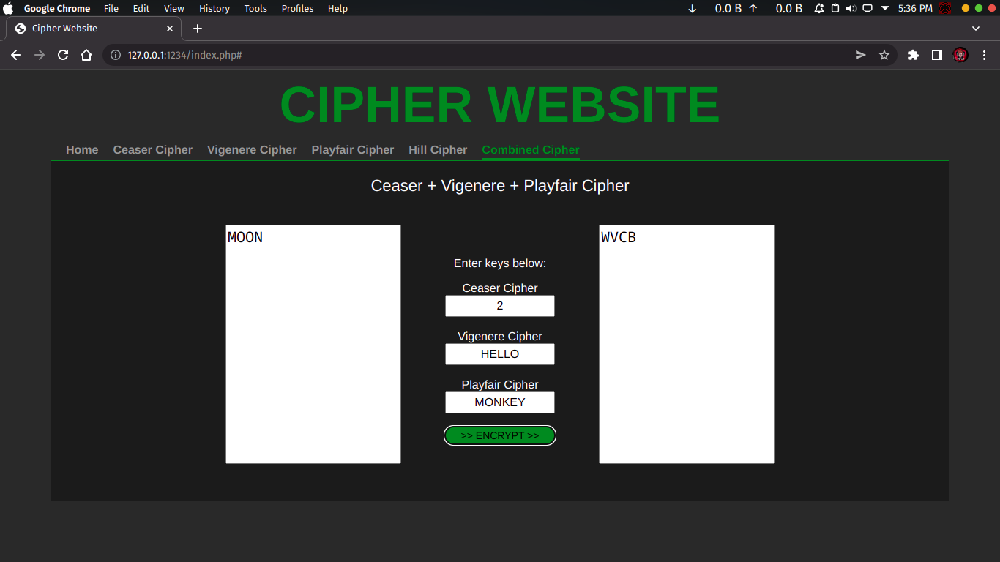
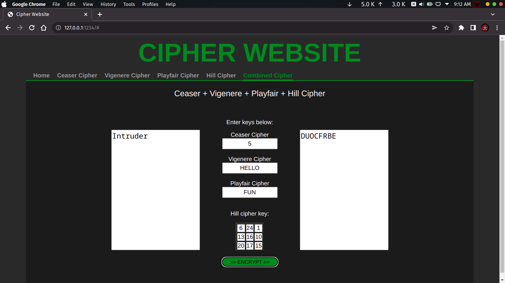

# EDWA
**Encryption Decryption Web Application** is a simple project to perform encryption and decryption.

<h3>Implemented Algorithms:</h3>

- Ceaser Cipher
- Vigenere Cipher
- Playfair Cipher
- Hill Cipher

### Requirements
- PHP
- Apache 2

### Deploy instructions (Debian based system):
```bash
git clone https://github.com/yashoswalyo/EDWA
sudo mv EDWA /var/www/html/
Open browser to http://localhost/EDWA
```

<hr>

## 
### Screenshots






